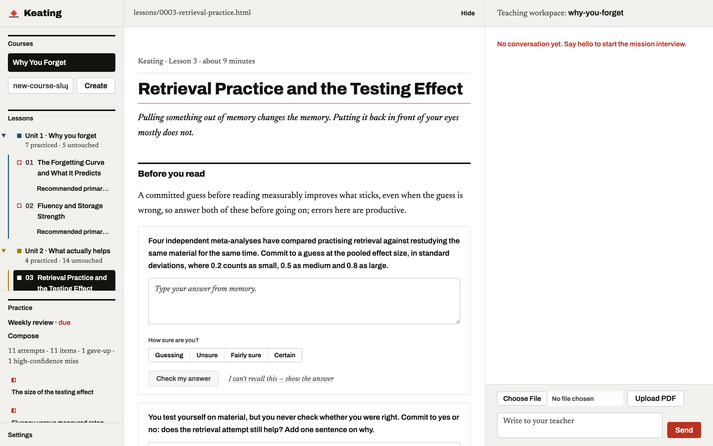
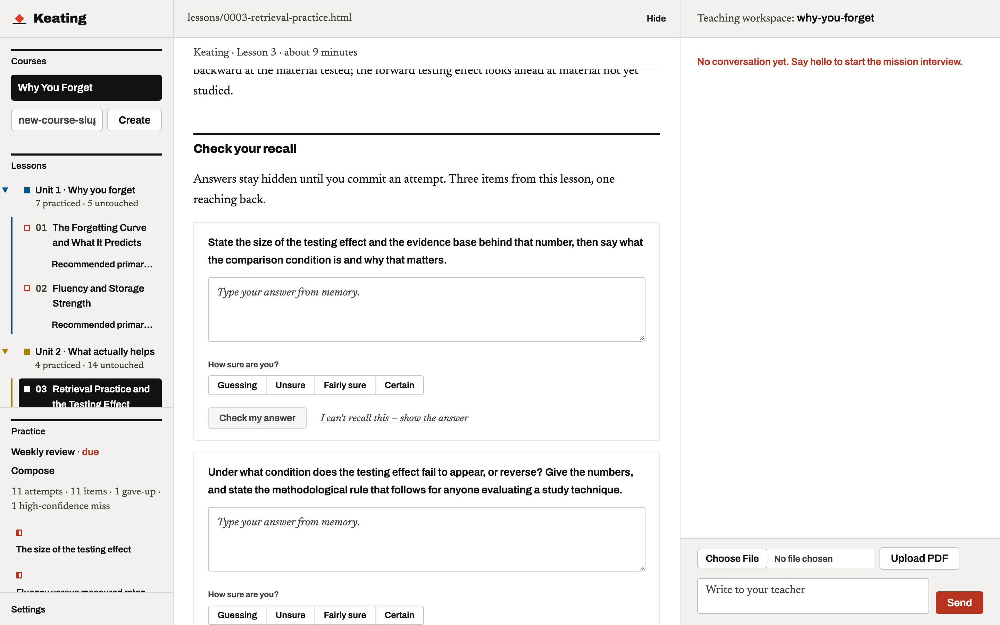
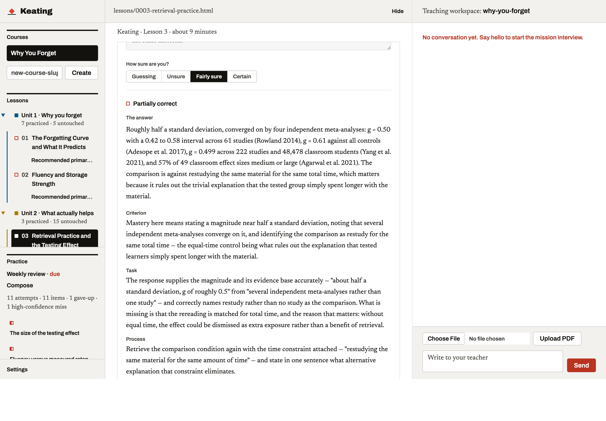
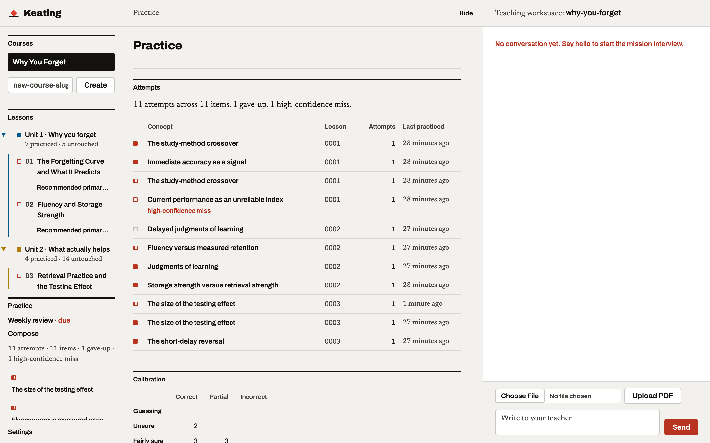
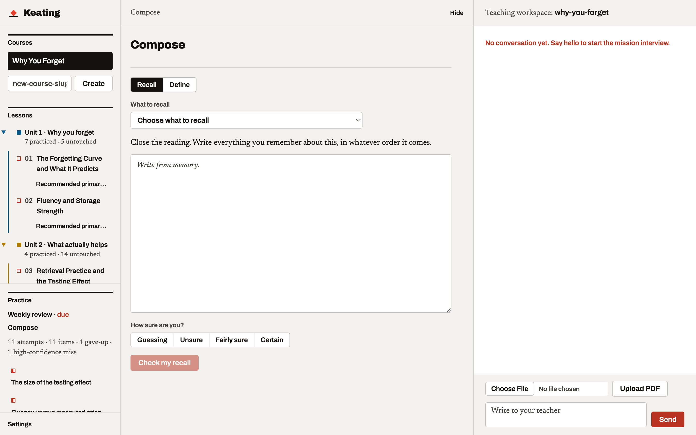

# Keating

<p align="center"><strong>AI-assisted learning that keeps the learning yours.</strong></p>

---

Keating is not an AI tutor. Getting a language model to explain something well is a solved
problem and it is not what this is for. Keating is a platform for **learning with** an AI that
is deliberately constrained: you do the retrieving, the generating, the explaining and the
judging, because that is where memory is actually built. The software does the bookkeeping.

The goal is **depth, not speed**. Nothing here is designed to get you through material faster.



## Why constrain the AI at all

In the largest randomised trial of AI assistance in learning to date, roughly a thousand
students given unrestricted GPT-4 during practice scored **48% better while they had it** and
**17% worse than the no-AI control** on a later closed-book exam. The mechanism was not bad
information; the model was right about half the time and its errors did not predict the decline.
The mechanism was answer-fetching. A guardrailed version, which withheld answers and gave hints,
eliminated the harm entirely.
([Bastani et al. 2025, *PNAS*](https://www.pnas.org/doi/10.1073/pnas.2422633122))

That result is the reason this software exists in the shape it does.

## What the AI does, and what it refuses to do

| It does | It will not |
|---|---|
| Grade a committed attempt against a rubric written alongside the question | Answer a question about material you are studying before you have attempted it |
| Critique a draft **after** you have written it, and show its version as a comparison | Write your glossary entries, summaries, free recalls, or learning records |
| Keep the practice log, compute what is due, and schedule review | Present a streak or a session score as evidence that you learned something |
| Build lessons, quiz items and rubrics from your syllabus and sources | Touch graded coursework, unless an assignment explicitly permits it |
| Ask for your attempt, then respond to what you actually wrote | Tell you that you are doing great. Feedback evaluates the response, never the person |
| Record what you know, when the evidence supports it | Claim you understand something without a graded attempt, an artifact you wrote, or a real-world report to cite |

The refusals are the very product.

## The evidence underneath

Every design rule traces back to our 
[`Scientific Charter`](docs/learning-science-foundations.md):

- **Retrieval beats review.** Practicing recall outperforms restudying the same material for the
  same time at *g* ≈ 0.50, across four independent meta-analyses and 222 classroom studies.
  ([Rowland 2014](https://doi.org/10.1037/a0037559);
  [Yang et al. 2021](https://doi.org/10.1037/bul0000309))
  So every quiz item requires a typed answer before it will show you anything.
- **The ranking of study methods flips with time.** Rereading beat testing 83% to 71% five
  minutes after study, and lost 40% to 61% a week later.
  ([Roediger & Karpicke 2006](https://doi.org/10.1111/j.1467-9280.2006.01693.x))
  So the platform measures delayed, unassisted recall and treats session performance as a
  vanity metric.
- **Spacing won 259 of 271 direct comparisons.**
  ([Cepeda et al. 2006](https://augmentingcognition.com/assets/Cepeda2006.pdf))
  So material you answered correctly today comes back tomorrow, and a night's sleep sits between
  first exposure and first verification.
- **You cannot feel your own learning.** Predictions of later recall are near-uncorrelated with
  actual recall, and they drive study decisions anyway. Judgments made *after* a retrieval
  attempt are dramatically better calibrated (*g* = 0.93).
  ([Rhodes & Tauber 2011](https://doi.org/10.1037/a0021705))
  So Keating asks how sure you are **before** it reveals anything, then shows you the gap.
- **Generating beats reading** at *d* = 0.40.
  ([Bertsch et al. 2007](https://doi.org/10.3758/BF03193441))
  So you draft the definition and the AI critiques it, never the reverse.
- **Interleaving helps for confusable material and reverses for unrelated material**
  (*g* = 0.67 vs *g* = −0.39).
  ([Brunmair & Richter 2019](https://doi.org/10.1037/bul0000209))
  So practice mixes across a unit's neighbouring concepts, not across arbitrary content.

## How it works

### Attempts are gated, graded, and recorded

No answer is ever one click away. You commit a response and a confidence rating first.



The grade comes back as four fixed parts, never a compliment: the criterion for mastery, how
this attempt relates to it **citing your own words**, one strategy to try next, and a question
to ask yourself. Every attempt lands in an append-only practice log.



That screenshot is a real attempt, graded live. The answer given was accurate as far as it went
and the response says so, then names exactly what was missing (the comparison is matched for
total time) and why the omission matters (without it, the effect could be dismissed as extra
exposure rather than a benefit of retrieval). Partially correct is reported as partially
correct.

### Your record is evidence, not vibes



Each square is one attempt: filled for correct, half for partial, hollow for wrong, grey for a
skip. Fill state carries the meaning, so the display works without colour. The calibration table
compares what you predicted against what happened, and high-confidence errors are flagged
because they are the most valuable thing in the system to re-test.

### You write; the AI critiques



Free recall and glossary entries are drafted from memory, then diffed against the AI's version:
what you had, what you missed, what is subtly off. Free recall is logged as a retrieval event,
so it feeds scheduling like any other attempt.

## Course packages

A course is stored once and can be handed to anyone. Learner state lives under `learners/`,
one directory per person, and never travels with it — copy the course directory without
`learners/` and what you hand over is the course package alone:

```
why-you-forget/
  course.json          manifest: title, units, and their order
  lessons/*.html       numbered lessons, each declaring the unit it belongs to
  assets/              shared stylesheet
  materials/           source material the course is taught from
  RESOURCES.md         curated, annotated sources
  learners/<id>/       one learner's own record — mission, notes, glossary,
                       learning records, practice log. Never shared, never
                       compared, never read from another learner's session.
```

[`examples/why-you-forget/`](examples/why-you-forget/) is a complete five-lesson course on the
memory research this platform is built on. Copy it into your workspace and you have something
real to try in about a minute.

### What a course page may load

Every page the app serves carries a Content-Security-Policy, and course-authored pages —
lessons, the daily review, the weekly review — get the strictest one their job allows. Two
consequences bind whoever writes a lesson, the AI teacher included:

- **Scripts must come from `/static/`.** `script-src 'self'` admits no inline `<script>`,
  no `onclick=` attribute, and no `eval`. Lesson interactivity goes through
  `/static/quiz.js`, which is what the authored quiz blocks already use. A
  `<script type="application/json">` data block is not executable and is unaffected.
- **Remote assets must come from the course package.** `img-src 'self'` and
  `media-src 'self'` mean a figure or an audio clip lives in the course directory, not on
  someone else's server. A webfont the course ships in `./assets/` is served from the
  course package too, and `font-src 'self'` admits it. Stylesheets may `@import` Google
  Fonts, as `assets/lesson.css` does — that one third-party origin is named in the policy
  — but any other remote font or stylesheet host is blocked.

A lesson that reaches past either line fails silently in the browser rather than loudly in
the server log, so it is worth knowing before you write one.

## Running it

Keating needs an Anthropic API key and a directory to keep your courses in. It runs as a
container or straight from source.

> **There is no authentication of any kind.** Anyone who can reach the port can read and write
> every file in your workspace. Publish it to `127.0.0.1` only, as shown below, and never to a
> public interface.

### With Docker

```sh
docker build -t keating .

mkdir -p ~/keating-courses
cp -r examples/why-you-forget ~/keating-courses/

docker run -d --name keating \
  -p 127.0.0.1:8000:8000 \
  -v ~/keating-courses:/workspace \
  -e ANTHROPIC_API_KEY=sk-ant-... \
  --user "$(id -u):$(id -g)" \
  keating
```

Open <http://127.0.0.1:8000>.

- `-p 127.0.0.1:8000:8000` binds the published port to the loopback interface. Dropping the
  `127.0.0.1:` prefix would expose an unauthenticated app to your whole network.
- `-v ~/keating-courses:/workspace` is where courses, all learner state, and this
  installation's own settings (`.keating/settings.json`) live. Everything the app writes goes
  here, so the container stays disposable and your work does not.
- `--user "$(id -u):$(id -g)"` makes files in the volume belong to you rather than to the
  container's user. The image runs unprivileged either way.

To keep the key out of your shell history and process list, put it in a file and use
`--env-file` instead of `-e`:

```sh
echo "ANTHROPIC_API_KEY=sk-ant-..." > keating.env
chmod 600 keating.env
docker run -d --name keating -p 127.0.0.1:8000:8000 \
  -v ~/keating-courses:/workspace --env-file keating.env \
  --user "$(id -u):$(id -g)" keating
```

The image never contains a key: `.env` is excluded from the build context, and credentials are
supplied at run time only.

### From source

Requires [`uv`](https://docs.astral.sh/uv/).

```sh
uv sync

mkdir -p ~/keating-courses
cp -r examples/why-you-forget ~/keating-courses/

echo "ANTHROPIC_API_KEY=sk-ant-..." > .env
uv run uvicorn main:app --host 127.0.0.1 --port 8000
```

`.env` is gitignored and read at startup, so restarts pick the key up automatically. If you
would rather not keep a key on disk at all, export `ANTHROPIC_API_KEY` in your shell, or run
`ant auth login` once and the SDK will find your stored credentials.

Courses live in `~/keating-courses` by default. Point `KEATING_WORKSPACE_ROOT` anywhere else.
The default deliberately sits outside this repository: a workspace holds your practice log,
chat history and learning records, and none of that belongs in the platform's source tree.

### Choosing models

The teaching model and the grading model are set separately in Settings, in the app. Grading is
a bounded rubric check, so a smaller model there is the main cost lever; teaching is where the
larger model earns its keep.

What you choose is saved in the workspace, as `.keating/settings.json` beside your courses, so
it belongs to the workspace rather than to the container or the checkout that wrote it. A
source installation that saved settings before they lived there has its `settings.json` copied
into the workspace on the next start, and the file it came from kept as `settings.json.migrated`
in case you pointed it at the wrong workspace. If a settings file already exists in both places,
nothing moves and the workspace copy is the one in use — startup says so on stdout, and editing
the one in the checkout will have no effect until you delete one of them.

## Accessibility

Every surface a learner can reach is scanned with [axe-core](https://github.com/dequelabs/axe-core),
driven through the real UI with Playwright rather than against rendered fragments, so each state
is the one a learner actually sees. Sixteen scans cover the app shell (empty, with a course
selected, and with a lesson open), a lesson both inside the reading pane's iframe and at its own
URL, the practice, compose and settings views, the generated review and weekly pages in both
their empty and populated states, a quiz item mid-attempt with submit armed, and the mobile
layout at 375px where the tab bar replaces the rails.

The rulesets are WCAG 2.0 A and AA, 2.1 A and AA, and 2.2 AA. axe's "best-practice" rules are
deliberately excluded: they are opinions worth having, but they are not WCAG failures, and a red
check should mean a standard was broken. There is no blanket rule disabling and the per-surface
exclusion list is currently empty — every violation the first scan found was fixed in the markup
or the CSS.

The suite runs on every pull request. To run it yourself:

```sh
uv sync
uv run playwright install chromium
uv run pytest tests/a11y
```

It starts the app on a free port against a throwaway workspace seeded from
`examples/why-you-forget`, so it never touches your courses, and it needs no API key — nothing in
it submits an attempt for grading. Raw axe output for each surface is written to `.a11y-report/`.

### What a passing check does and does not mean

**Automated testing detects roughly a third of WCAG failures.** A green check means no
*detectable* violations, which is not the same as conformance and is not a claim of ADA
compliance. Whether the focus order makes sense, whether every control can be reached and
operated from the keyboard, whether a screen reader announces something a person can act on,
and whether the alternative text is actually *useful* rather than merely present — none of that
is machine-checkable, and all of it still needs a person.

What the scan does do is catch the failures that are unambiguous, and it earns its place: the
first run against this codebase found three real ones. The reading pane's preview iframes had no
accessible name, so a screen reader announced them as an unlabelled frame with no way to tell
what was in it. Several form controls had no programmatic label, leaving them announced by
nothing but their position. And there was no skip link, so every keyboard user re-traversed the
entire course sidebar to reach the lesson they had just opened. All three are fixed, and the
suite is what keeps them fixed.

## The name

John Keating is the teacher in [Dead Poets Society](https://en.wikipedia.org/wiki/Dead_Poets_Society) who stands on his desk to remember to look
at things another way, and who refuses to hand Todd Anderson a poem, pushing until Todd produces
one himself. That refusal is the whole idea.

## License

MIT. See [LICENSE](LICENSE).
